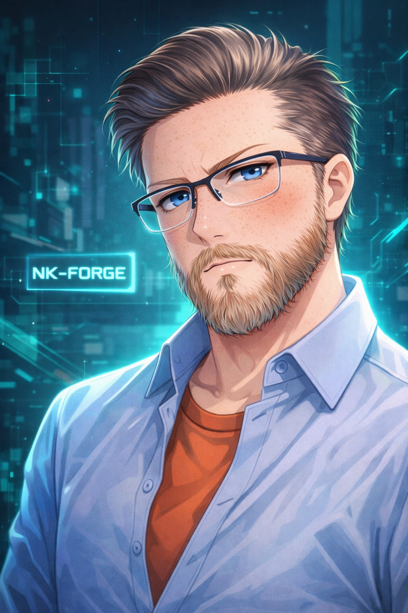

# Nevin Kadlec — Full-Stack Software Engineer | Product Builder | Founder of NK-Forge

**Building practical software systems for real-world workflows: web apps, desktop tools, backend services, automation, and AI-assisted engineering.**

  

---

## About

I am a full-stack software engineer and product builder based in Fargo, North Dakota.

Through NK-Forge, I build and refine practical software across full-stack web applications, backend systems, desktop utilities, automation tools, and AI-assisted engineering workflows.

My background is not limited to code. I have worked around warehouses, manufacturing, equipment, trucking, and real-world operations long enough to care deeply about software that fits how people actually work. I value clear workflows, reliable systems, useful automation, and tools that reduce friction instead of adding more of it.

I build with a verification-first mindset: clear architecture, documented decisions, tests, CI checks, runtime validation, and careful review before calling work complete.

---

## What I Build

* **Full-stack applications** — React, TypeScript, Node.js, APIs, auth, PostgreSQL, deployment, and documentation
* **Backend systems** — service boundaries, job processing, retries, data modeling, concurrency, and operational visibility
* **Desktop tools** — Electron and local-first utilities for file workflows, automation, and user-controlled operations
* **Business automation** — scripts, pipelines, dashboards, data processing, and workflow cleanup
* **AI-assisted engineering tools** — structured workflows that use AI as a force multiplier while keeping human verification in the loop
* **Practical product prototypes** — taking rough ideas from problem statement to usable, testable software

---

## Technical Focus

**Frontend**
React, TypeScript, JavaScript, HTML, CSS, TailwindCSS, responsive UI, dashboard interfaces

**Backend**
Node.js, Express, ASP.NET Core, REST APIs, authentication, PostgreSQL, Entity Framework Core

**Desktop & Local Tools**
Electron, Python, Tkinter, local file workflows, installer/release packaging

**Data & Automation**
CSV/Excel processing, pandas, NumPy, validation pipelines, reporting, workflow automation

**DevOps & Engineering Practices**
Git, GitHub Actions, Docker, CI/CD, testing, API design, documentation, issue-driven development

---

## Public Projects Worth Reviewing

### Document Dispatch Service

Distributed document-processing simulator built with ASP.NET Core, Entity Framework Core, PostgreSQL, Docker, background workers, retries, lease-based job coordination, Prometheus metrics, and an operations dashboard.

**Why it matters:**
Shows backend engineering, concurrency thinking, production-style workflow design, operational visibility, and maintainable service architecture.

---

### Full-Stack E-Commerce Application

React + Node/Express + PostgreSQL application with Google OAuth, Stripe Checkout, Stripe webhooks, Swagger/OpenAPI documentation, tests, linting, and deployed functionality.

**Why it matters:**
Shows end-to-end product delivery across frontend, backend, authentication, payments, APIs, database modeling, and deployment.

---

### Warhammer 40,000: Space Marine 2 Mod Loader / Launcher

A Windows desktop mod loader and launcher for *Warhammer 40,000: Space Marine 2*, designed to simplify mod management while maintaining game stability and user control.

**Key Features:**

* Automated mod detection and management
* Safe enable/disable workflows
* Local file handling and user-controlled operations
* Modded and vanilla launch workflows
* Release distribution through Nexus Mods

**Why it matters:**
Shows user-facing desktop software, local workflow design, packaging/release thinking, and support for real users outside a classroom or tutorial environment.

**Download:**
[Space Marine 2 Mod Loader and Game Launcher — NK-Forge](https://www.nexusmods.com/warhammer40000spacemarine2/mods/381?tab=files)

---

### ForgeBoard

Full-stack project board application using React, Node/Express, PostgreSQL/Neon, testing, security middleware, and deployment-ready structure.

**Why it matters:**
Shows practical full-stack workflow design, data modeling, API structure, frontend/backend integration, and clean project organization.

---

## Private / In-Progress Engineering Case Studies

Some of my larger projects are private because they contain family data, business logic, security-sensitive workflows, unreleased product direction, or internal automation details. I still list them here because they reflect the kind of systems I am actively building.

### NK-Forge Orchestrator

A TypeScript CLI/workspace system for coordinating AI-assisted engineering work across missions, tickets, reviews, generated documentation, and repeatable development checks.

**Focus areas:**
Local AI orchestration, structured engineering workflows, CI validation, documentation generation, review loops, project automation, and multi-agent task planning.

---

### NK-Forge Classroom

A private household education platform for assigning coursework, tracking student progress, reviewing work, managing subjects, and supporting parent/student role-based workflows.

**Focus areas:**
Full-stack architecture, authentication, role isolation, PostgreSQL schema design, household-scoped data access, API contracts, testing, and CI.

---

### Ember

A private business operations and invoicing platform focused on clients, invoices, payment tracking, reporting, and small-business workflow clarity.

**Focus areas:**
Product modeling, dashboard UX, financial workflow design, data validation, reporting, and maintainable full-stack structure.

---

### Email List Cleaner

A desktop utility for validating, cleaning, deduplicating, and preparing email lists from CSV, TXT, and spreadsheet workflows.

**Focus areas:**
Local-first processing, privacy-conscious tooling, file handling, validation pipelines, user review before destructive actions, and export workflows.

---

### DevShark.work

A product concept for skill-based developer matching focused on verified ability instead of résumé keyword filtering.

**Focus areas:**
Assessment design, anti-cheat thinking, AI-aware evaluation, candidate/company matching, and practical hiring workflows.

---

## Engineering Principles

I try to build software the way real work actually happens.

* Understand the workflow before overbuilding the solution
* Keep architecture understandable enough to maintain
* Validate behavior with tests, CI, and runtime checks
* Document decisions so future work is easier
* Prefer useful reliability over fragile cleverness
* Use AI carefully, but never as a substitute for verification
* Build tools that respect the people who actually have to use them
* Improve the system with each pass instead of chasing short-term hacks

---

## Current Focus

* Hardening NK-Forge Orchestrator into a practical engineering force multiplier
* Building private systems into polished case studies without exposing sensitive code
* Improving public project documentation, screenshots, and deployment notes
* Continuing to grow across full-stack engineering, backend systems, automation, and applied AI workflows

---

## Contact

* **Portfolio:** [nevinkadlec.com](https://nevinkadlec.com)
* **GitHub:** [github.com/NK-Forge](https://github.com/NK-Forge)
* **LinkedIn:** [linkedin.com/in/nevin-kadlec](https://www.linkedin.com/in/nevin-kadlec/)
* **Email:** [dev@nkforge.com](mailto:dev@nkforge.com)

---

*Based in Fargo, North Dakota. Building practical software for real-world workflows.*
